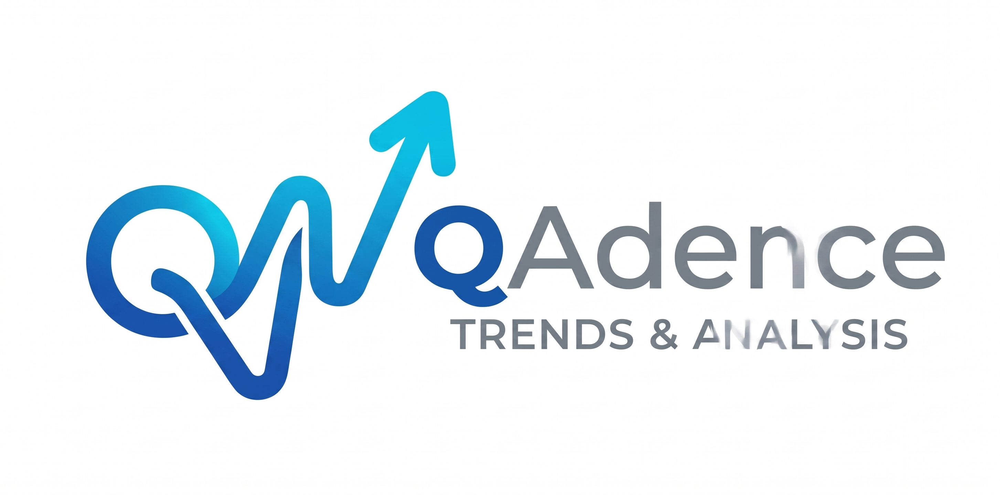

# QAdence: Trends & Analysis

<p align="center">
  
</p>

<p align="center">
  <strong>Longitudinal Trend & Statistical Analysis Platform for QATrack+ Patient Quality Assurance</strong>
</p>

---

## Overview

**QAdence** is a modern, high-performance web application designed for medical physics and radiation oncology teams. It connects seamlessly to [QATrack+](https://qatrackplus.com/) instances to ingest, organize, visualize, and analyze Patient Specific QA metrics across linear accelerators, treatment planning systems, and delivery techniques.

With QAdence, clinics can identify machine-specific drift, compare delivery techniques (e.g. VMAT vs. IMRT, 6MV vs. 10MV), run statistical process control (SPC) charts, and filter datasets using multi-tier criteria.

---

## Key Features

- **Longitudinal Trend Analysis**: Plot continuous measurement variables (Gamma Pass Rates, Median Dose Deviations, Point Doses, Temperature/Pressure) across time, linacs, or energies.
- **Multi-Dataset Comparison**: Create and overlay multiple distinct datasets simultaneously with custom colors, linac selections, date intervals, and variable conditions.
- **QATrack+ Integration**:
  - **Fast Structure Sync**: Sync linac units, active test list assignments, and measurement definitions in seconds without pulling historical raw records.
  - **On-Demand & Full Sync**: Fetch historical QA sessions with live memory tracking, background batching, and progress indicators.
  - **Active-Only Ingestion**: Automatically excludes decommissioned linacs, inactive test list assignments, and empty test lists.
- **Interactive Visualizations**:
  - Scatter / Line Trend charts with linear regressions, moving averages, and control limits ($\pm 1\sigma, 2\sigma, 3\sigma$).
  - Categorical Box Plots and Histograms for distribution analysis.
  - High-performance Data Matrix view for tabular inspection and CSV export.
- **Preset Management**: Save, update, overwrite, and delete view configurations and filter criteria.

---

## Tech Stack

- **Frontend**:
  - React 19
  - Vite 8
  - Chart.js & react-chartjs-2
  - Lucide Icons
- **Backend**:
  - Node.js & Express 5
  - SQLite with `better-sqlite3` (zero-latency embedded caching)
  - Axios REST client for QATrack+ API v1/v2/v3

---

## Getting Started

### Prerequisites

- Node.js 18.x or later
- npm or yarn

### Installation

1. Clone the repository:
   ```bash
   git clone https://github.com/jabu184/QAdence.git
   cd QAdence
   ```

2. Install dependencies:
   ```bash
   npm install
   npm --prefix client install
   ```

3. Build the client bundle:
   ```bash
   npm run build
   ```

4. Start the application server:
   ```bash
   npm start
   ```

5. Access the app in your browser at `http://localhost:3001`.

---

## QATrack+ Connection

Click the **Settings** gear icon in the navigation bar to configure your QATrack+ endpoint:
- **Base URL**: `https://your-qatrack-server.local`
- **Authentication**: `API-Key` or `Token`
- **Auth Token**: Enter your generated QATrack+ API key

Once saved, click **Sync Structure** to instantly discover your active Linacs and QA test collections.

---

## License

ISC License.
